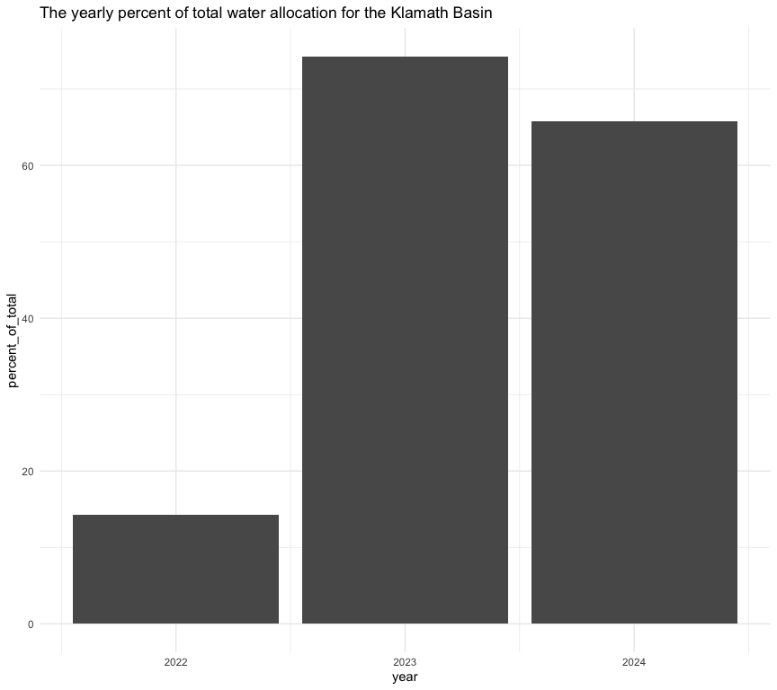
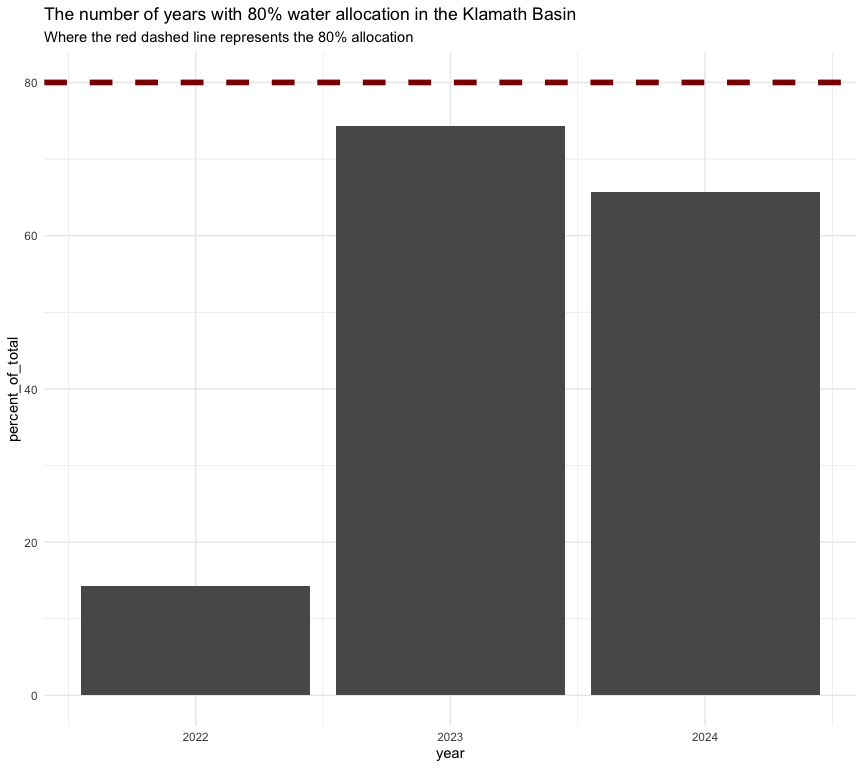
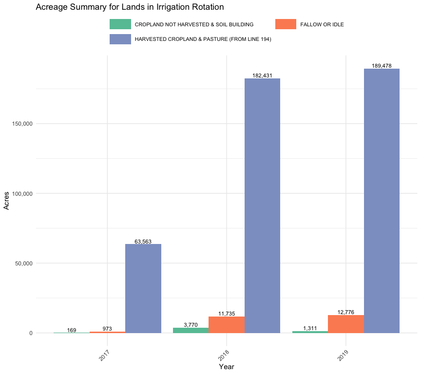

Agriculture Subgroup Attributes
================
Maddee Rubenson (FlowWest)
2025-06-30

## Draft Attributes:

- % of full water allocation 

- Number of consecutive years with at least 80% water allocation 

- Number of acres in production vs. fallow

- Groundwater depletion rates vs. recharge rates 

- Acre feet returned (after use) to the basin, annual, and seasonal
  measure

### Percent of Full Water Allocation

A full water supply from Upper Klamath Lake for the Klamath Project is
approximately 450,000 acre-feet, but USBR currently limits diversions to
no more than 350,000 acre-feet regardless of how much water is
physically available.[^1]

``` r
yearly_water_allocation = data.frame(
  "year" = c(2024, 2023, 2022),
  "amount_acre_feet" = c(230000, 260000, 50000),
  "source" = c("https://www.usbr.gov/mp/kbao/docs/2024-klamath-project-annual-operations-plan.pdf", "https://www.usbr.gov/mp/kbao/programs/docs/20230705-2023-klamath-project-drought-plan.pdf", "https://www.usbr.gov/newsroom/news-release/4168")
) |> 
  mutate(percent_of_total = amount_acre_feet/350000 * 100)
```

Visualize the percent of total water allocation

``` r
yearly_water_allocation |> 
  ggplot(aes(x = year, y = percent_of_total)) +
  geom_col() + 
  theme_minimal() + 
  ggtitle("The yearly percent of total water allocation for the Klamath Basin")
```

<!-- -->

### Number of consecutive years with at least 80% water allocation

``` r
yearly_water_allocation |> 
  ggplot(aes(x = year, y = percent_of_total)) +
  geom_col() + 
  geom_hline(aes(yintercept = 80), linetype = "dashed", linewidth = 2, color = "darkred") + 
  theme_minimal() + 
  ggtitle("The number of years with 80% water allocation in the Klamath Basin", 
          subtitle = "Where the red dashed line represents the 80% allocation") 
```

<!-- -->

### Groundwater Depletion and Recharge Rates

We do know that the amount of groundwater extraction is different every
year. Based on publicly available information and input from local water
managers, the maximum in-season groundwater production to meet
irrigation demand within the Klamath Project is estimated to not exceed
144,000 acre-feet per year. However, the U.S. Geological Survey
estimates that the average sustainable yield (i.e., the level of
withdrawal that can be maintained without overdrafting the aquifer and
adversely affecting groundwater levels) is 54,000 acre-feet per year (US
Geological Survey, 2016).[^2]

### Number of acres in production vs. fallow

``` r
acreage_summary |>
  filter(!grepl("TOTAL", Description),
         Description !=  "ACRES IRRIGATED (LINES 11 + 12)", 
         Description != 'ACRES IRRIGATED (LINES 11 +12)')  |>
  filter(State == "CA") |> 
  filter(!is.na(Total)) |> 
  mutate(in_irrigation = ifelse(in_irrigation == "yes", "In Irrigation", "Not in Irrigation")) |> bind_rows(
    acreage_summary |>
      filter(!grepl("TOTAL", Description),
             Description !=  "ACRES IRRIGATED (LINES 11 + 12)", 
             Description != 'ACRES IRRIGATED (LINES 11 +12)')  |>
      filter(State == "OR") |> 
      filter(!is.na(Total)) |> 
      mutate(in_irrigation = ifelse(in_irrigation == "yes", "In Irrigation", "Not in Irrigation")) ) |> 
  filter(in_irrigation == "In Irrigation") |> 
  group_by(Description, Report) |> 
  summarise(total_acres = sum(Total)) |> 
  ggplot(aes(x = factor(Report), y = total_acres, fill = Description)) +
  geom_col(position = position_dodge()) +
  geom_text(
    aes(label = comma(total_acres)),
    position = position_dodge(width = 0.9),
    vjust = -0.25,
    size = 3
  ) +
  xlab("Year") +
  ylab("Acres") +
  ggtitle("Acreage Summary for Lands in Irrigation Rotation") +
  scale_fill_brewer(palette = "Set2") +
  scale_y_continuous(labels = comma) +
  guides(
    fill = guide_legend(
      ncol   = 2,    
      byrow  = TRUE  
    )
  ) +
  theme_minimal() +
  theme(
    legend.position   = "top",
    legend.title      = element_blank(),
    legend.text       = element_text(size = 8),             
    legend.key.width  = unit(1.2, "cm"),                    
    strip.text        = element_text(size = 10),           
    axis.text.x       = element_text(angle = 45, hjust = 1) 
  )
```

    ## `summarise()` has grouped output by 'Description'. You can override using the
    ## `.groups` argument.

<!-- -->

[^1]: <https://www.siskiyoucounty.gov/naturalresources/page/water-reductions-klamath-basin-devastate-jobs-and-local-economy#>:~:text=For%20context%2C%20the%20USBR’s%20current,zero%20and%20155%2C000%20acre%2Dfeet.

[^2]: <https://www.siskiyoucounty.gov/sites/default/files/fileattachments/natural_resources/page/30885/highland_economics_final_klamath_basin_agriculture_economic_analysis.pdf>
