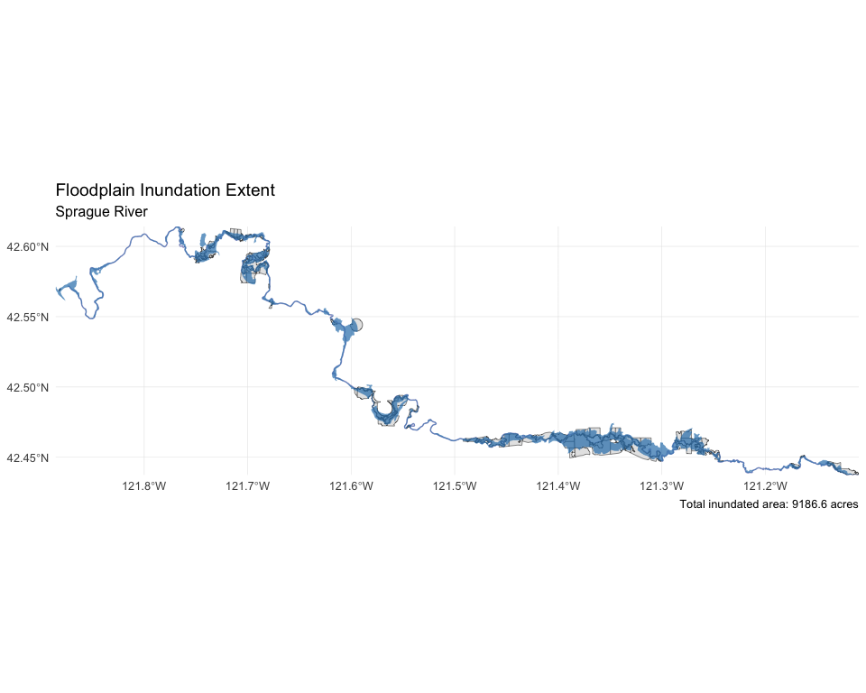
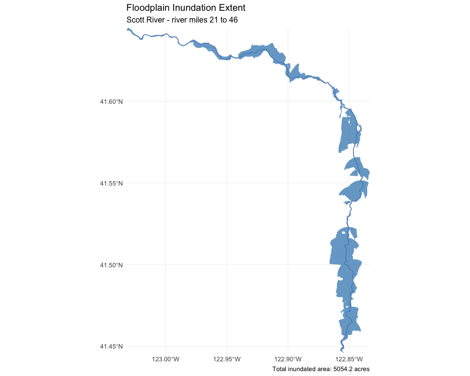
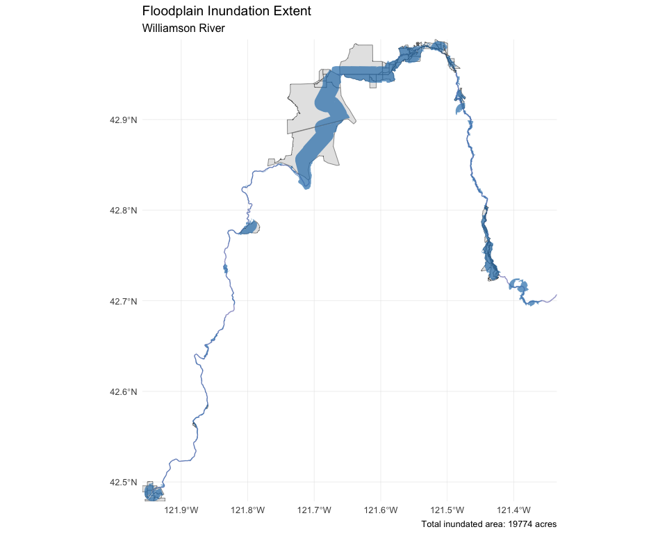
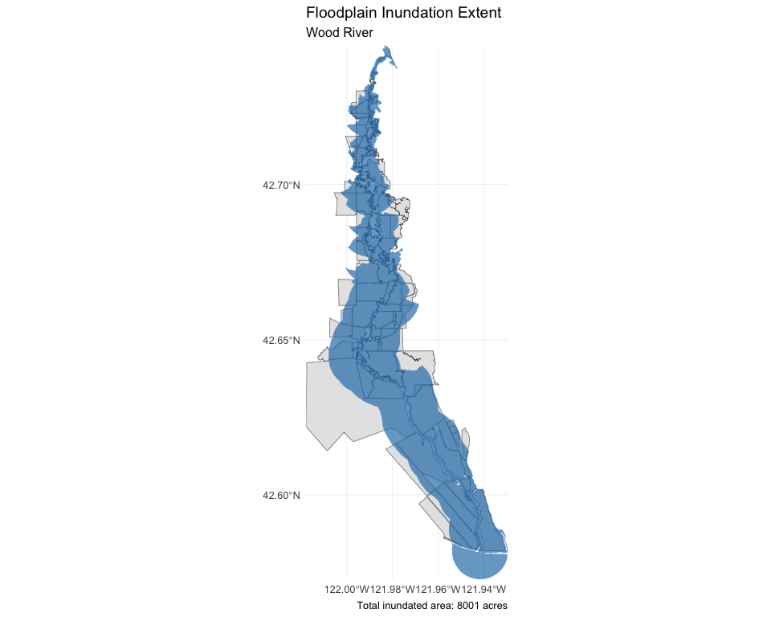
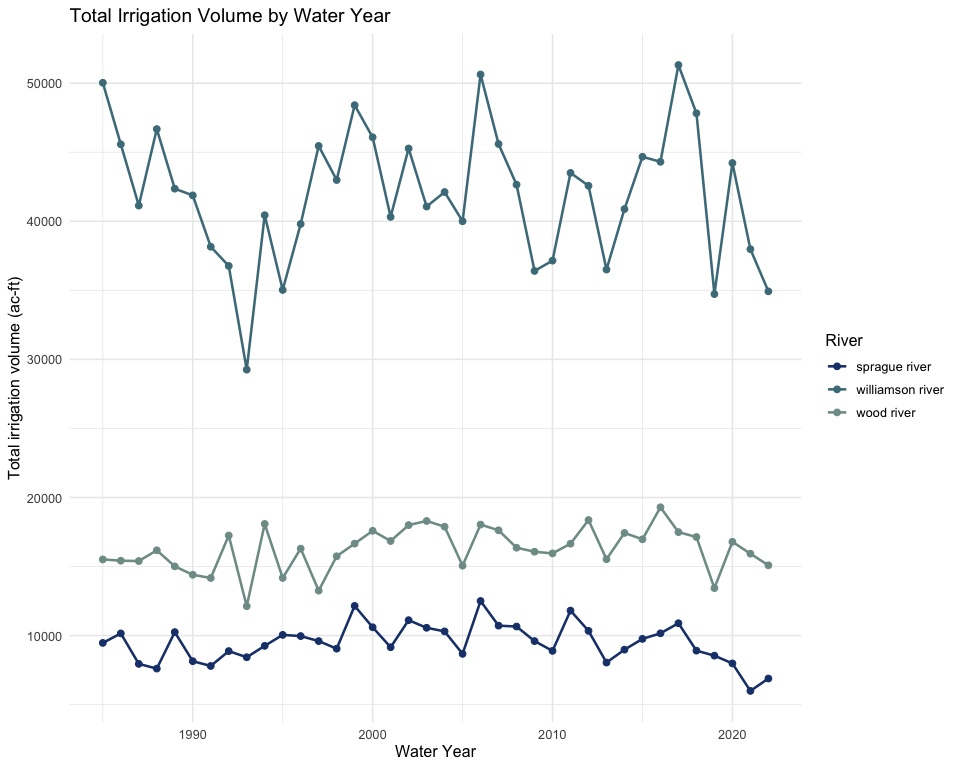
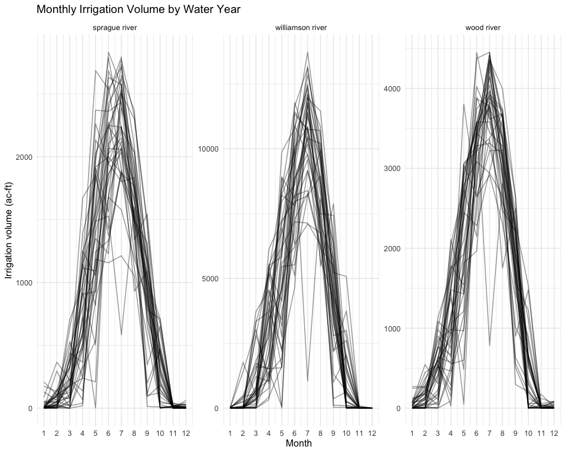

Theoretical Maximum Floodplain Inundation Mapping
================
Maddee Wiggins
2026-03-27

## Overview

This document describes the steps required to develop a data object
designed to evaluate potential floodplain reconnection outcomes.
Specifically, it includes: 1) estimates of maximum floodplain inundation
assuming theoretical levee and dike removal, 2) identification of fields
impacted by inundation, and 3) estimates of irrigation volumes and acres
linked to fields that may be taken out of production.

## Estimate Maximum Floodplain Inundation

The bathtub approach is a simple DEM-based method used to approximate
floodplain inundation by comparing terrain elevation to a specified
water surface elevation (WSE). In this framework, the landscape is
treated as if water fills the topography like a rising bathtub: all
cells in the DEM with elevations lower than the assumed WSE are
classified as inundated. To improve realism, the analysis typically
restricts inundation to areas hydraulically connected to the river
channel, which prevents isolated depressions from being incorrectly
labeled as flooded. Because it relies only on elevation and an assumed
stage, the bathtub method is computationally efficient and well suited
for scenario screening, visualization, and communication of potential
flood extents. However, it does not simulate hydraulic processes such as
flow momentum, roughness, backwater effects, or levee overtopping, and
therefore represents a static approximation rather than a physically
dynamic flood model.

**Assumptions**

- Segment lengths = 1000 meters

- WSE = mean elevation of each segment + 0.6 (calculated from the DEM)

- Slope threshold = 1% (segments that had a slope greater than 1% were
  removed)

- Field inundation threshold = 30% (field must overlap \> 30% to be
  included in the fields impacted)

- Negative irrigation volumes are set to 0

### Run Scott River Inundation

Clip Scott River to areas of active restoration (river miles 21 - 46).

``` r
scott_river_sf <- rivermile::scott_river |> 
  filter(river_mile >= 21 & river_mile <= 46) |> 
  arrange(dist_from_start_m) |>           
  summarise(geometry = st_combine(x)) |> 
  st_cast("LINESTRING") |> 
  mutate(river = "Scott River") 

scott_inundation <- run_inundation_segments(dem, scott_river_sf, wse = NULL, stage_m = 0.6, buffer_m = 1000)
#> [1] "number of segments: 41"
#> [1] "number of segments <1% slope: 41"
scott_inundation$acres_inundated
#> [1] 5054.152
```

### Run Sprague River Inundation

``` r
river_sf <- rivermile::all_klamath_rivers_line |> filter(river == "Sprague River")

sprague_inundation <- run_inundation_segments(dem, river_sf, wse = NULL, stage_m = 0.6, buffer_m = 1000)
#> [1] "number of segments: 138"
#> [1] "number of segments <1% slope: 138"
sprague_inundation$acres_inundated
#> [1] 9186.58
```

### Run Williamson River Inundation

``` r
river_sf <- rivermile::all_klamath_rivers_line |> filter(river == "Williamson River")

williamson_inundation <- run_inundation_segments(dem, river_sf, wse = NULL, stage_m = 0.6, buffer_m = 1000)
#> [1] "number of segments: 166"
#> [1] "number of segments <1% slope: 158"
williamson_inundation$acres_inundated
#> [1] 19774.05
```

### Run Wood River Inundation

``` r
river_sf <- rivermile::all_klamath_rivers_line |> filter(river == "Wood River")

wood_inundation <- run_inundation_segments(dem, river_sf, wse = NULL, stage_m = 0.6, buffer_m = 1000)
#> [1] "number of segments: 33"
#> [1] "number of segments <1% slope: 33"
wood_inundation$acres_inundated
#> [1] 8001.046
```

## Agricultural Fields Impacted

This data comes from Desert Research Institute:
<https://www.dri.edu/project/owrd-et/>. The study provides a long-term
record of monthly and annual satellite-based actual crop ET and
consumptive use of irrigation water, potential crop ET and irrigation
water requirements, applied irrigation water, and open water evaporation
estimates for all major water bodies within the Oregon hydrographic
area.

``` r
sprague_fields <- summarize_field_impacts(
  inund_poly = sprague_inundation$inundation_aggregate,
  fields_sf = klamath_irr_vol,
  pct_overlap_threshold = 30
)

sprague_fields$total_field_acres
#> [1] 4386.803
sprague_fields$n_fields_touched
#> [1] 112

williamson_fields <- summarize_field_impacts(
  inund_poly = williamson_inundation$inundation_aggregate,
  fields_sf = klamath_irr_vol,
  pct_overlap_threshold = 30
)

williamson_fields$total_field_acres
#> [1] 14423.83
williamson_fields$n_fields_touched
#> [1] 100

wood_fields <- summarize_field_impacts(
  inund_poly = wood_inundation$inundation_aggregate,
  fields_sf = klamath_irr_vol,
  pct_overlap_threshold = 30
)

wood_fields$total_field_acres
#> [1] 6149.23
wood_fields$n_fields_touched
#> [1] 153
```

### Irrigation Volumes

``` r
sprague_irr_monthly <- irrigation_vol_summary(sprague_fields$fields_impacted, "sprague river")

williamson_irr_monthly <- irrigation_vol_summary(williamson_fields$fields_impacted, "williamson river")

wood_irr_monthly <- irrigation_vol_summary(wood_fields$fields_impacted, "wood river")
```

## Create data object

``` r
floodplain_acres <- data.frame(location = c("sprague river", "scott river", 
                                            "williamson river", "wood river"),
                               inundated_acres = c(sprague_inundation$acres_inundated,
                                                   scott_inundation$acres_inundated,
                                                   williamson_inundation$acres_inundated,
                                                   wood_inundation$acres_inundated),
                               field_acres = c(sprague_fields$total_field_acres, 
                                               NA, 
                                               williamson_fields$total_field_acres, 
                                               wood_fields$total_field_acres),
                               n_fields_touched = c(sprague_fields$n_fields_touched, 
                                                    NA, 
                                                    williamson_fields$n_fields_touched, 
                                                    wood_fields$n_fields_touched))

knitr::kable(floodplain_acres)
```

| location         | inundated_acres | field_acres | n_fields_touched |
|:-----------------|----------------:|------------:|-----------------:|
| sprague river    |        9186.580 |    4386.803 |              112 |
| scott river      |        5054.152 |          NA |               NA |
| williamson river |       19774.048 |   14423.826 |              100 |
| wood river       |        8001.046 |    6149.230 |              153 |

``` r
all_irr_summary <- bind_rows(sprague_irr_monthly,
                             williamson_irr_monthly,
                             wood_irr_monthly)

knitr::kable(all_irr_summary |> head(20))
```

| year | month | irr_vol_acft | location      | water_year | date       |
|-----:|------:|-------------:|:--------------|-----------:|:-----------|
| 1984 |    11 |    5.7374051 | sprague river |       1985 | 1984-11-01 |
| 1984 |    12 |    0.0000000 | sprague river |       1985 | 1984-12-01 |
| 1985 |     1 |    0.0829068 | sprague river |       1985 | 1985-01-01 |
| 1985 |     2 |    0.0288835 | sprague river |       1985 | 1985-02-01 |
| 1985 |     3 |  311.1953033 | sprague river |       1985 | 1985-03-01 |
| 1985 |     4 | 1673.7856064 | sprague river |       1985 | 1985-04-01 |
| 1985 |     5 | 1845.7691137 | sprague river |       1985 | 1985-05-01 |
| 1985 |     6 | 2276.0989121 | sprague river |       1985 | 1985-06-01 |
| 1985 |     7 | 1816.8152572 | sprague river |       1985 | 1985-07-01 |
| 1985 |     8 | 1525.4517878 | sprague river |       1985 | 1985-08-01 |
| 1985 |     9 |   13.1932002 | sprague river |       1985 | 1985-09-01 |
| 1985 |    10 |  475.8669639 | sprague river |       1986 | 1985-10-01 |
| 1985 |    11 |   24.7131697 | sprague river |       1986 | 1985-11-01 |
| 1985 |    12 |   28.4045133 | sprague river |       1986 | 1985-12-01 |
| 1986 |     1 |    0.0000000 | sprague river |       1986 | 1986-01-01 |
| 1986 |     2 |    9.1546572 | sprague river |       1986 | 1986-02-01 |
| 1986 |     3 |  101.4469273 | sprague river |       1986 | 1986-03-01 |
| 1986 |     4 | 1389.7770433 | sprague river |       1986 | 1986-04-01 |
| 1986 |     5 | 1797.4296680 | sprague river |       1986 | 1986-05-01 |
| 1986 |     6 | 2250.5339495 | sprague river |       1986 | 1986-06-01 |

Save data object

``` r
usethis::use_data(floodplain_acres, overwrite = TRUE)
usethis::use_data(all_irr_summary, overwrite = TRUE)
```

## Visuals











``` r
knitr::knit_exit()
```
